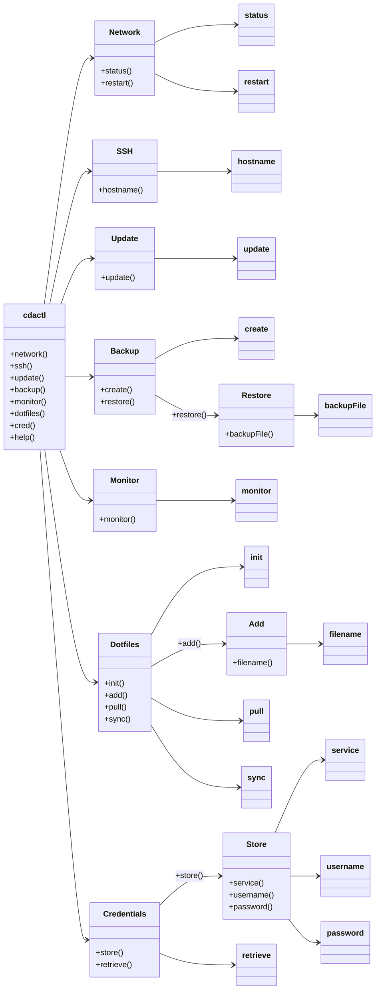

<style>
  .header-image {
    display: block;
    margin-left: auto;
    margin-right: auto;
    width: 100%;
    height: auto;
    padding: 0;
  }
</style>

# cdactl - Command Line Utility for Device Management


## Overview

`cdactl` is a powerful and versatile command-line utility designed to simplify the management of your devices. It offers streamlined operations for network connections, SSH access, system updates, backups, system resource monitoring, dotfiles management, and secure credential storage. Ideal for DevOps professionals, system administrators, and developers, `cdactl` enhances productivity across multiple devices and environments!


## Features

- **Network Management**: 
  - Check network status.
  - Restart network services.
  
- **SSH Access**: 
  - Seamlessly SSH into devices with ease.
  
- **System Updates**: 
  - Update and upgrade system packages effortlessly.
  
- **Backups**: 
  - Create and restore comprehensive system backups.
  
- **System Resource Monitoring**: 
  - Monitor system resources in real-time.
  
- **Dotfiles Management**: 
  - Initialize, add, pull, and sync dotfiles stored in the [cdaprod/cda.cfg](https://github.com/cdaprod/cda.cfg) repository.
  
- **Credential Management**:
  - Securely store and retrieve credentials for various services using `export GPG_PASSPHRASE="your-own-secret-password"`.

- **Tool Installation**:
  - Install and update helper binaries from GitHub Releases with `cdactl install` and `cdactl update`.

## Diagram



## Installation

You can install `cdactl` using either the Makefile or manually. Choose the method that best fits your workflow.

### Using Makefile

```sh
git clone https://github.com/Cdaprod/cdactl.git
cd cdactl
sudo make install
```

### Manual Installation

#### Primary Tool

```sh
sudo cp src/cdactl /usr/local/bin/
sudo chmod +x /usr/local/bin/cdactl
```

#### Color Definitions & Utility Functions

```sh
sudo cp src/cda-common.sh /usr/local/lib/
sudo chmod +x /usr/local/lib/cda-common.sh
```

#### Man Pages

```sh
sudo cp man/cdactl.1 /usr/share/man/man1/
sudo gzip /usr/share/man/man1/cdactl.1
```

## Usage

Run `cdactl` followed by a command and its respective options. Below are the available commands and their usage examples:

### Network Management

- **Check Network Status**

  ```sh
  cdactl network status
  ```

- **Restart Network Services**

  ```sh
  cdactl network restart
  ```

### SSH Access

- **SSH into a Device**

  ```sh
  cdactl ssh <hostname>
  ```

### System Updates

- **Update System Packages**

  ```sh
  cdactl update
  ```

### Backups

- **Create a Backup**

  ```sh
  cdactl backup create
  ```

- **Restore from a Backup**

  ```sh
  cdactl backup restore <backup_file>
  ```

### System Resource Monitoring

- **Monitor System Resources**

  ```sh
  cdactl monitor
  ```

### Dotfiles Management

`cdactl` provides an efficient way to manage your dotfiles using a bare Git repository. It supports initializing the repository, adding files, pulling updates, and syncing changes. Dotfiles are stored in a branch named after the device's architecture and hostname, ensuring unique branches for each device.

- **Initialize Dotfiles Repository**

  ```bash
  cdactl dotfiles init
  ```

- **Add a Dotfile**

  ```bash
  cdactl dotfiles add <file>
  ```

- **Pull Dotfiles from Remote**

  ```bash
  cdactl dotfiles pull
  ```

- **Sync Dotfiles with Remote**

  ```bash
  cdactl dotfiles sync
  ```

- **Pull a Specific Dotfile from a Branch**

  ```bash
  cdactl dotfiles pull-file <branch> <filename.ext>
  ```

### Credential Management

`cdactl` securely stores and retrieves credentials for various services, ensuring sensitive information is protected.

- **Store Credentials**

  ```bash
  export GPG_PASSPHRASE="your-own-secret-password"
  cdactl cred store <service> <username>
  ```

  You will be prompted to enter the password securely.

- **Retrieve Credentials**

  ```bash
  cdactl cred retrieve
  ```

### Help

- **Display Help Message**

  ```sh
  cdactl help
  ```

## Dotfiles Management

`cdactl` simplifies dotfiles management by utilizing a bare Git repository. This ensures your configuration files are version-controlled and easily synchronized across multiple devices.

### Initializing Dotfiles Repository

```bash
cdactl dotfiles init
```

This command initializes a bare Git repository in `~/.cfg` and sets up an alias in your shell configuration for easy Git operations.

### Adding a Dotfile

```bash
cdactl dotfiles add <file>
```

Adds the specified dotfile to the repository and pushes it to the remote branch corresponding to your device.

### Pulling Dotfiles

```bash
cdactl dotfiles pull
```

Pulls the latest dotfiles from the remote repository for your device-specific branch.

### Pulling a Specific Dotfile

```bash
cdactl dotfiles pull-file <branch> <filename.ext>
```

Pulls a specific dotfile from the specified branch, ensuring precision in synchronization.

### Syncing Dotfiles

```bash
cdactl dotfiles sync
```

Synchronizes all dotfiles with the remote repository, ensuring consistency across devices.

## Credential Management

Managing credentials securely is crucial. `cdactl` leverages Git's credential storage to handle sensitive information without exposing it in plain text.

### Storing Credentials

1. **Set the GPG Passphrase**

   ```bash
   export GPG_PASSPHRASE="your-own-secret-password"
   ```

2. **Store the Credentials**

   ```bash
   cdactl cred store <service> <username>
   ```

   You will be prompted to enter the password securely.

### Retrieving Credentials

```bash
cdactl cred retrieve
```

Displays the stored credentials for your reference.

## Man Page


Access the manual page for detailed information on commands and usage:

```sh
man cdactl
```

## Contributing

Contributions are highly appreciated! Whether you have suggestions for new features, improvements, or bug fixes, feel free to open an issue or submit a pull request.

1. **Fork the Repository**

2. **Create a Feature Branch**

   ```sh
   git checkout -b feature/YourFeature
   ```

3. **Commit Your Changes**

   ```sh
   git commit -m "Add your message"
   ```

4. **Push to the Branch**

   ```sh
   git push origin feature/YourFeature
   ```

5. **Open a Pull Request**

## License

This project is licensed under the [MIT License](LICENSE). See the [LICENSE](LICENSE) file for more details.

## Contact

For any questions, support, or inquiries, please reach out through the following channels:

- **GitHub**: [Cdaprod](https://github.com/Cdaprod)
- **Twitter**: [@cdasmktcda](https://twitter.com/cdasmktcda)
- **LinkedIn**: [cdasmkt](https://www.linkedin.com/in/cdasmkt)

---

# Tags

`#devops`, `#dotfiles`, `#systemadmin`, `#credentials`, `#backup`, `#monitoring`
```

---

## Explanation of Updates

1. **Visual Enhancements**:
   - Added alt text to images for better accessibility.
   - Included usage image in the Overview section for visual representation.

2. **Structured Features Section**:
   - Organized features into sub-points for clarity.
   - Highlighted each feature with bold text for emphasis.

3. **Detailed Usage Instructions**:
   - Provided clear command examples for each feature.
   - Included additional commands like `pull-file` for comprehensive coverage.

4. **Expanded Dotfiles Management**:
   - Added explanations for each dotfiles subcommand.
   - Emphasized the use of device-specific branches for organized management.

5. **Enhanced Credential Management**:
   - Clarified the steps for storing and retrieving credentials.
   - Ensured security best practices are highlighted.

6. **Man Page Section**:
   - Added instructions on how to access the manual page.

7. **Contribution Guidelines**:
   - Provided step-by-step instructions for contributing to the project.

8. **Consistency and Clarity**:
   - Ensured consistent formatting throughout the README.
   - Improved readability with clear headings and organized content.

9. **Added License and Contact Sections**:
   - Clearly stated the licensing information.
   - Provided multiple contact methods for user support and inquiries.

10. **Tags Section**:
    - Maintained relevant tags for easy categorization and searchability.

These updates aim to make the README more user-friendly, comprehensive, and aligned with best practices, ensuring that users can effectively utilize `cdactl` for their device management needs.
