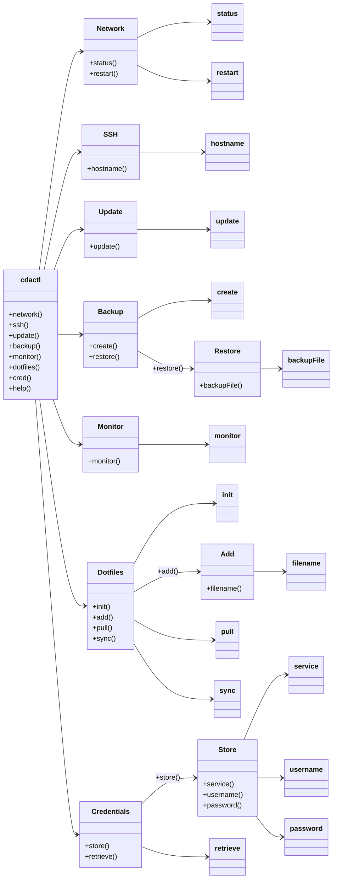

<style>
  .header-image {
    display: block;
    margin-left: auto;
    margin-right: auto;
    width: 100%;
    height: auto;
    padding: 0;
  }
</style>

# cdactl - Command Line Utility for Device Management


## Overview

`cdactl` is a versatile command-line utility designed to streamline the management of network connections, SSH access, system updates, backups, system resource monitoring, dotfiles management, and credential storage for your devices. This tool is particularly useful for DevOps professionals, system administrators, and developers working across multiple devices and environments.



## Features

- **Network Management**: Check network status and restart network services.
- **SSH Access**: Easily SSH into devices.
- **System Updates**: Update and upgrade system packages.
- **Backups**: Create and restore backups of your system.
- **System Resource Monitoring**: Monitor system resources in real-time.
- **Dotfiles Management**: Initialize, add, pull, and sync dotfiles are stored in the [cdaprod/cda.cfg](https://github.com/cdaprod/cda.cfg) repository.
- **Credential Management**: Securely store and retrieve credentials for various services using `export GPG_PASSPHRASE="your-own-secret-password"`.

## Installation

#### Using Makefile

```sh
git clone https://github.com/Cdaprod/cdactl.git
cd cdactl
sudo make install
```

#### Manual Installation

```sh
sudo cp src/cdactl /usr/local/bin/
sudo chmod +x /usr/local/bin/cdactl
sudo cp man/cdactl.1 /usr/share/man/man1/
sudo gzip /usr/share/man/man1/cdactl.1
```

## Usage


Run `cdactl` followed by a command and options. The available commands are:

- **network**: Manage network connections
  - `cdactl network status`
  - `cdactl network restart`

- **ssh**: SSH into devices
  - `cdactl ssh <hostname>`

- **update**: Update system packages
  - `cdactl update`

- **backup**: Manage backups
  - `cdactl backup create`
  - `cdactl backup restore <backup_file>`

- **monitor**: Monitor system resources
  - `cdactl monitor`

- **dotfiles**: Manage dotfiles
  - `cdactl dotfiles init`
  - `cdactl dotfiles add <file>`
  - `cdactl dotfiles pull`
  - `cdactl dotfiles sync`

- **cred**: Manage credentials
  - `cdactl cred store <service> <username>`
  - `cdactl cred retrieve`

- **help**: Show help message
  - `cdactl help`

## Dotfiles Management

`cdactl` provides a convenient way to manage your dotfiles using a bare Git repository. It supports initializing the repository, adding files, pulling updates, and syncing changes. The dotfiles are stored in a branch named after the device's architecture and hostname, ensuring unique branches for each device.

### Initializing Dotfiles Repository

```bash
cdactl dotfiles init
```

### Adding a Dotfile

```bash
cdactl dotfiles add <file>
```

### Pulling Dotfiles

```bash
cdactl dotfiles pull
```

### Syncing Dotfiles

```bash
cdactl dotfiles sync
```

## Credential Management

`cdactl` can securely store and retrieve credentials for various services using the `cred` command. This ensures that sensitive information is handled securely and is not exposed in plain text.

### Storing Credentials

```bash
export GPG_PASSPHRASE="your-own-secret-password"
```

```bash
cdactl cred store <service> <username>
```
You will be prompted to enter the password securely.

### Retrieving Credentials

```bash
cdactl cred retrieve
```

## Man Page


## Contributing

Contributions are welcome! Please open an issue or submit a pull request if you have suggestions for improvements or new features.

## License

This project is licensed under the MIT License. See the [LICENSE](LICENSE) file for details.

## Contact

For any questions or support, please open an issue in the repository or contact the maintainer:

- GitHub: [Cdaprod](https://github.com/Cdaprod)
- Twitter: [@cdasmktcda](https://twitter.com/cdasmktcda)
- LinkedIn: [cdasmkt](https://www.linkedin.com/in/cdasmkt)

---

# Tags

`#devops`, `#dotfiles`, `#systemadmin`, `#credentials`, `#backup`, `#monitoring`